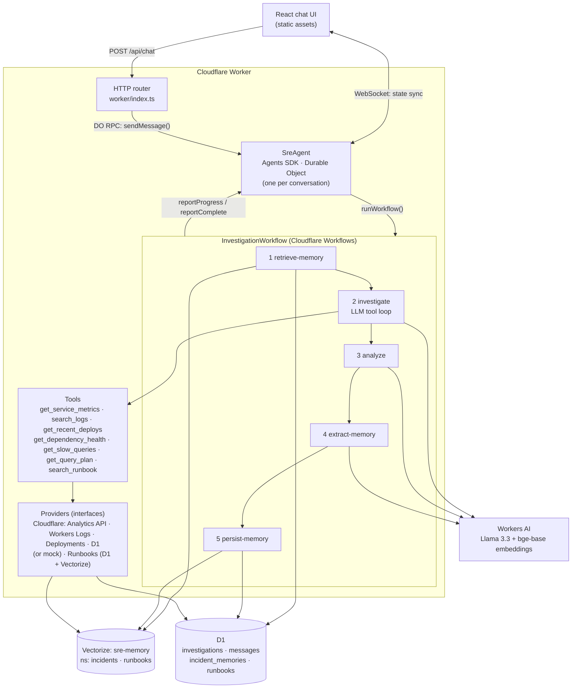
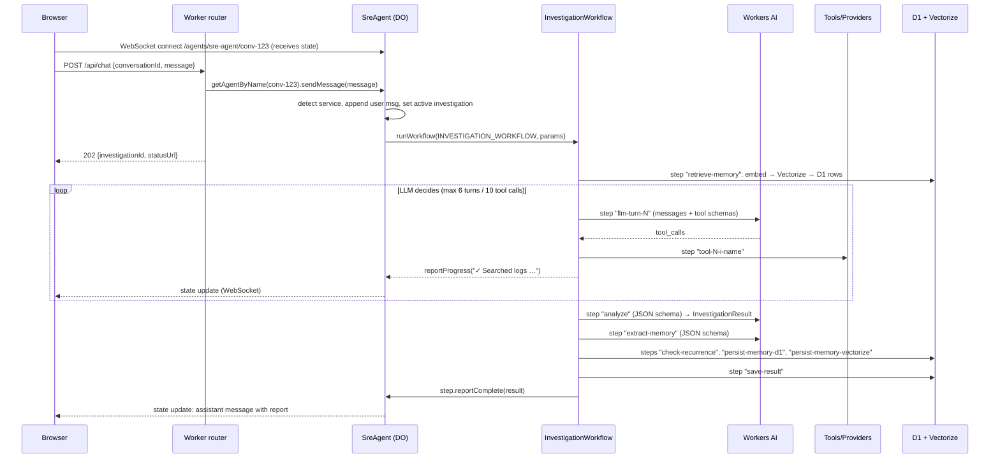
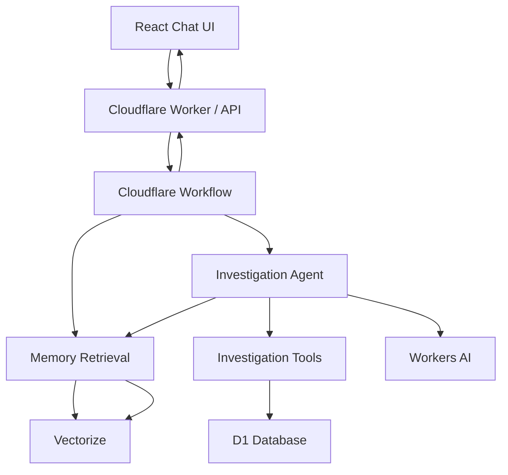

# SRE Investigation Agent

An AI incident-investigation agent built entirely on Cloudflare's developer platform.

You describe an incident in a chat UI, e.g. *"API latency is high for payment-service. Investigate."* The agent then:

1. recalls similar **past incidents** from long-term semantic memory,
2. investigates using **tools it chooses itself**, over **real Cloudflare telemetry** of the Workers it monitors (metrics, logs, deploys, D1 queries and query plans, runbooks),
3. writes a structured **investigation report** with the likely cause, evidence, and a recommendation,
4. **remembers** the useful conclusions so a later *"it's slow again, have we seen this before?"* is answered from memory.

It is **investigation-only**. It recommends actions and never changes infrastructure.

**Live demo:** https://sre-investigation-agent.yaahg342.workers.dev (monitored Worker: https://demo-shop.yaahg342.workers.dev)

| Requirement | How it is met |
|---|---|
| LLM | Workers AI, `@cf/meta/llama-3.3-70b-instruct-fp8-fast` |
| Agent / tool calling | LLM-driven tool loop over 7 tools: metrics, logs, deploys, dependency health, slow queries, query plans, runbooks |
| Real data | Workers Analytics (GraphQL), Workers Logs, Deployments/Versions API, D1 query insights + `EXPLAIN QUERY PLAN`, for a demo Worker (`demo-shop`) that is broken on purpose with real deploys |
| Multi-step coordination | Cloudflare Workflow: memory → investigate → analyze → extract memory → persist |
| Chat UI | React (Vite), live progress over WebSocket |
| Short-term memory | Agents SDK state (one Durable Object per conversation) |
| Long-term semantic memory | D1 (structured records) + Vectorize (embeddings, `bge-base-en-v1.5`) |
| Cloudflare-native deploy | One Worker: static assets + API + Agent + Workflow |

---

## 1. Architecture



### Separation of responsibilities

| Layer | Responsibility | Code |
|---|---|---|
| **Router** | HTTP only: validate input and forward it | `worker/index.ts` |
| **Agent** | Conversation session: short-term memory, starting workflows, relaying progress to browsers | `worker/agents/sre-agent.ts` |
| **Workflow** | Durable orchestration: ordering, retries, checkpoints | `worker/workflows/investigation-workflow.ts` |
| **Investigator (LLM)** | Reasoning: decides *which* tools to call and *when* to stop | `worker/agents/investigator.ts` |
| **Tools** | Retrieve information through provider interfaces; never throw at the LLM | `worker/tools/` |
| **Providers** | Talk to infrastructure (mock today, pluggable) | `worker/providers/` |
| **Memory** | Store and retrieve distilled incident knowledge | `worker/memory/` |
| **Data access** | All SQL | `worker/db/repositories.ts` |

The Workflow does **not** hardcode tool calls. It runs one `investigate` phase, and inside it the LLM picks tools turn by turn. Each LLM turn and each tool call the LLM makes is wrapped in its own `step.do`, so the sequence is dynamic and every call is still checkpointed.

---

## 2. Why each Cloudflare service

| Service | Why |
|---|---|
| **Workers** | Serverless compute for the API, the static React build, and the host for everything else. |
| **Agents SDK** | A stateful Agent per conversation (a Durable Object with SQLite). Built-in state sync to browsers over WebSocket (`useAgent`), `@callable` RPC, and first-class Workflow integration (`runWorkflow`, `onWorkflowProgress`). |
| **Workers AI** | Serverless GPU inference with no API keys. Llama 3.3 70B handles reasoning and function calling. `bge-base-en-v1.5` produces 768-dim embeddings. |
| **Workflows** | An investigation is a multi-step job with several LLM calls (~10–60 s). Workflows give per-step retries, checkpointing, and resumability, so a transient AI/D1 error doesn't restart the investigation or re-bill LLM calls. |
| **D1** | Relational source of truth: investigations (for polling and audit), transcript, incident memories, runbooks. |
| **Vectorize** | Semantic search over incident memories and runbooks. It uses one index with two **namespaces** (`incidents`, `runbooks`). Vectors hold only ids and minimal metadata; content lives in D1. |

Nothing else is used: no Redis, Kafka, queues, auth providers, or external APIs.

---

## 3. End-to-end request flow



The API also supports clients that don't hold a WebSocket open: `GET /api/investigations/:id` returns status, progress steps, and the final result from D1.

---

## 4. Agent / tool-calling flow

`runInvestigation()` in `worker/agents/investigator.ts` is a plain, testable loop:

```
messages = [system prompt, …recent conversation turns, user request + retrieved memories]
repeat (≤ 8 turns, ≤ 14 tool calls):
    response = durable("llm-turn-N", llm.chat(messages, tools))
    if no tool calls → done (the model has written its findings)
    for each call (≤ 4 per turn):
        result = durable("tool-N-i-name", executeTool(call))   // never throws
        append {assistant: call JSON} and {tool: result JSON} to messages
budget exhausted → one last call with tools disabled: "summarize now"
```

How the loop keeps the model honest:

- **Evidence baseline.** If the model tries to conclude about a known service without having called metrics, logs and recent deploys, it is nudged once with the list of missing tools.
- **Causal chains.** Prompts require explaining every abnormal metric and stating the cause as *trigger → mechanism → symptom*.
- **Tool failures are data, not exceptions.** `executeTool` returns `{ ok: false, error }`, e.g. `Unknown service "billing". Known services: …`. The system prompt forbids inventing metrics, and the analysis step lists failures under *Could not retrieve*. If every tool failed, confidence is forced to `unknown` regardless of what the model says.
- **Duplicate calls are not re-executed.** Identical calls reuse the earlier result and tell the model to try something else.
- **Llama quirks are handled.** `tool_calls` arguments may be objects or strings, and Llama sometimes prints a call as text (`{"name": …, "parameters": …}` or `<function=…>`). Both are recovered (`worker/llm/parsing.ts`).
- **No hidden chain-of-thought.** Prompts ask for conclusions and evidence only, and the report contains only structured conclusions.

After the loop, two JSON-mode LLM calls run (`worker/agents/analysis.ts`):

- **analyze**: produces an `InvestigationResult` (`summary, likelyCause, confidence, evidence[], previousIncidents[], recommendation, nextSteps[]`). Fields the system already knows (`toolsUsed`, `unavailable`, `memory`) are filled in deterministically, not by the LLM.
- **extract-memory**: see below.

A message that needed no tools (e.g. "hi") becomes a `kind: "conversation"` reply. It gets no report and stores no memory.

---

## 5. Memory architecture

### Short-term memory: the conversation

- Each conversation id maps to one `SreAgent` instance (`getAgentByName(env.SreAgent, conversationId)`).
- `this.state` holds `{ messages, active, lastService }`. `setState()` persists it to the Durable Object's SQLite and pushes it to every connected tab. Reloading the page restores the conversation.
- The last 6 turns go to the LLM as history, with earlier reports condensed to summary, cause, and recommendation. `lastService` lets *"is it happening again?"* resolve to the service discussed earlier.
- Clients can read state but not write it (`validateStateChange` rejects client writes). They act through `POST /api/chat` or `@callable` methods.
- D1 `messages` keeps a durable audit copy of the transcript.

### Long-term memory: distilled incident knowledge

The agent does **not** store conversations. After an investigation:

1. **Gate (deterministic):** only `kind: investigation` results with a service, a concrete cause, and `high`/`medium` confidence qualify. Greetings, failed or low-confidence runs, and "unknown cause" are never stored.
2. **Extract (LLM, JSON schema):** keep only facts useful for future incidents:
   ```json
   {
     "service": "payment-service",
     "problem": "high API latency",
     "cause": "database connection pool exhaustion",
     "resolution": "increase DB pool from 20 to 40",
     "symptoms": ["p95 latency 1850ms", "DB connection timeouts"],
     "evidence": ["database connection pool exhausted: active=20 max=20"]
   }
   ```
   The service name is taken from the investigation, not from the LLM.
3. **Recurrence check:** the memory is embedded and compared with existing ones. At ≥ 0.9 similarity for the same service, the existing memory's `occurrences` is incremented instead of storing a duplicate.
4. **Persist:** a D1 row (`incident_memories`) plus a Vectorize vector with the same id in namespace `incidents`. The id is derived from the workflow instance id, so a retried step cannot create duplicates.

**Retrieval (workflow step 1):** the user message is embedded with the detected service prepended. Vectorize returns the top 3, and those ids are joined to D1 rows. A match counts as relevant at cosine ≥ **0.65 for the same service** and ≥ **0.8 for other services**. Retrieval is semantic rather than keyword-based: in live testing, *"Payment service is slow again. Have we seen this before?"* matched the memory *"High API latency … Database connection pool exhaustion"* at **0.782** even though they share almost no words.

**Why the stricter cross-service bar:** with a single 0.6 threshold, an order-service CPU incident retrieved the payment-service pool-exhaustion memory. The LLM anchored on it, searched logs for "connection pool", and misdiagnosed the incident. Stricter cross-service matching, plus prompts that say "start from current metrics; a memory is a hypothesis that must be independently confirmed", fixed it: the rerun found the real cause (missing index on `lower(customer_email)`).

**Eventual consistency:** Vectorize writes become queryable after a delay (about 1–2 minutes observed on a new index). A memory saved seconds ago may not be recalled yet. Vectors whose D1 row is gone are ignored, both in retrieval and in the recurrence check.

**Degradation:** if Vectorize (or the embedding model) is unavailable, retrieval falls back to the most recent D1 memories for the same service and the UI shows *"Semantic memory degraded"*. If D1 also fails, the investigation proceeds with no memory.

---

## 6. Workflow architecture

`InvestigationWorkflow extends AgentWorkflow` (from `agents/workflows`). The `AgentWorkflow` base links the workflow instance to the Agent that started it:

| Step name | Retries | Notes |
|---|---|---|
| `retrieve-memory` | 3 × exp. backoff | Never throws; falls back internally |
| `llm-turn-N`, `tool-N-i-<tool>`, `llm-final` | LLM: 2, tools: part of the same wrapper | Dynamic steps chosen by the LLM |
| `analyze` | 2 | On failure, a *degraded* report is built from the investigator's findings |
| `extract-memory` | 2 | On failure, nothing is stored |
| `check-recurrence` → `record-recurrence` **or** `persist-memory-d1` → `persist-memory-vectorize` | 3 | Idempotent writes |
| `save-result` | 3 | D1 copy for polling; failure does not lose the report |
| `step.reportComplete(result)` | durable | → `SreAgent.onWorkflowComplete` |

Points worth knowing about Workflows:

- **Checkpointing.** A completed `step.do` result is stored. On retry or resume, completed steps return their cached value, so the LLM isn't asked again and tools aren't re-run.
- **Replay determinism.** Code outside steps can run more than once, so everything non-deterministic (LLM, I/O, `Date.now()`) lives inside steps. Progress reports sit outside steps on purpose. They're cheap, and the Agent upserts them by key, so replays don't duplicate lines in the UI.
- **Errors.** If the LLM is unavailable after retries, the workflow marks the D1 record `failed` and throws. `AgentWorkflow` reports that to `SreAgent.onWorkflowError`, which posts a clear error message. A stale `active` investigation (no callback within 10 minutes) doesn't block the conversation forever.

---

## 7. Observability providers: live Cloudflare telemetry (default) or mocks

Tools depend only on interfaces (`worker/providers/types.ts`):

```ts
interface MonitoringProvider { listServices(); getServiceMetrics(service) }
interface LogProvider        { searchLogs(service, query, { limit }) }
interface DeployProvider     { getRecentDeploys(service, hours) }
interface DependencyProvider { getDependencyHealth(service) }
interface DatabaseProvider   { getSlowQueries(service, limit); getQueryPlan(service, queryId) }
interface RunbookProvider    { searchRunbooks(query, limit) }
```

`PROVIDER_MODE` in `wrangler.jsonc` picks the implementation (`worker/deps.ts`).

### `PROVIDER_MODE = "cloudflare"` (default): real telemetry

The agent investigates real Cloudflare Workers listed in `SERVICE_CATALOG`, using data Cloudflare already records for them. No third-party observability service is involved.

| Tool | Real data | Cloudflare source |
|---|---|---|
| `get_service_metrics` | Requests, errors, wall-time latency p50/p95/p99, CPU time, invocation status; last 15 min vs the previous hour; breakdown **by deployed version** | GraphQL Analytics `workersInvocationsAdaptive` |
| `search_logs` | The Worker's real `console.log` / `console.error` lines and exceptions (last 30 min) | Workers Logs, via the Workers Observability telemetry query API |
| `get_recent_deploys` | Deploy time, author, message, and **config changes** (diff of each version's vars against the previous deployment) | Workers Deployments + Versions API |
| `get_slow_queries` | Top D1 queries by total time: calls, mean/p95 ms, rows read vs returned (the data behind `wrangler d1 insights`) | GraphQL `d1QueriesAdaptiveGroups` |
| `get_query_plan` | SQLite `EXPLAIN QUERY PLAN` (`SCAN` vs `SEARCH … USING INDEX`) plus the table's indexes | D1 query API (read-only; only single `SELECT` statements are explained) |
| `get_dependency_health` | The Worker's D1 database: queries, rows read per query, batch time p50/p99 vs the previous hour | GraphQL `d1AnalyticsAdaptiveGroups` |
| `search_runbook` | Runbook knowledge base | Vectorize + D1 |

Details worth knowing:
- Latency is **Worker wall time**, which includes waiting on D1. Workers Analytics reports it in microseconds; the provider converts to ms.
- `errors` counts invocations that **threw**. A handled `Response(…, {status: 500})` counts as a success in this dataset, which is why demo-shop re-throws its failures.
- Cloudflare analytics usually appear after about 1–3 minutes.
- Credentials: a Cloudflare API token in the `CF_API_TOKEN` secret (see §10). If it's missing, every tool returns a clear "telemetry unavailable" error, and the agent reports that instead of guessing.

### `PROVIDER_MODE = "mock"`: simulated services

These are used by the unit tests, and for demos without a monitored Worker. `worker/providers/mock/scenarios.ts` simulates four services with clues spread across tools:

| Service | Situation |
|---|---|
| `payment-service` | Deploy calls a slow fraud API inside a DB transaction → connections held longer → pool exhaustion |
| `order-service` | Deploy adds a partial-email search that can't use the index → full table scans → high CPU |
| `notification-service` | Campaign burst + synchronous sends + too few consumers → Kafka consumer lag |
| `inventory-service` | Healthy baseline |

**Other backends** (Prometheus, Loki, Postgres, Datadog, …) implement the same interfaces and plug in at `worker/deps.ts`. Tools, prompts, the agent loop, and the workflow don't change.

Runbooks (`worker/runbooks/index.ts`) are **data**, not prompts: symptoms, investigation steps, possible causes, recommended actions, and verification steps for *high-api-latency, database-connection-pool-exhaustion, slow-database-query, high-cpu, kafka-consumer-lag, elevated-error-rate*. They are seeded into D1 and Vectorize on first use (or via `POST /api/admin/seed-runbooks`) and reach the LLM only through `search_runbook`.

### The demo target: `demo-shop`

`demo-shop/` is a deliberately small Worker for the agent to investigate: one D1 table (`products`, 10,000 rows) and three endpoints.

| Endpoint | Query |
|---|---|
| `GET /products/:id` | Primary-key lookup |
| `GET /search?category=&q=` | Baseline: `WHERE category = ? ORDER BY price` (uses `idx_products_category_price`) |
| `GET /health` | No DB |

Incidents are created by **real deploys**, so they appear in the real deploy history:

| Command | What it deploys | What the telemetry shows |
|---|---|---|
| `npm run demo:deploy` | Baseline | Healthy: ~20 rows read per search |
| `npm run demo:break-search` | `FEATURE_FULLTEXT_SEARCH=on`: search becomes `lower(name) LIKE '%q%' …` | Rows read per search 20 → 10,000; the plan changes to `SCAN products` + `USE TEMP B-TREE FOR ORDER BY`; the deploy shows `FEATURE_FULLTEXT_SEARCH: off → on` |
| `npm run demo:break-errors` | `FAULT_ERROR_RATE=0.2`: 20% of requests throw *"InventoryClient: upstream connect error (pool=inventory-v2)…"* | Error rate ~20% on the new version only (`scriptThrewException`), exception lines in Workers Logs, the config change in the deploy history |
| `npm run demo:fix` | Baseline again | Recovery |
| `npm run demo:load -- <url> [minutes]` | — | Traffic: ~3 lookups/s + 1 search every 2 s |

The failure is injected, but everything the agent reads is genuine Cloudflare telemetry of a real, running Worker.

**D1 free plan:** 5M rows read/day. A full-scan search reads 10,000 rows, so a 3-minute load run with the bad version reads about 1M rows.

---

## 8. Project structure

```
wrangler.jsonc                 bindings: AI, VECTORIZE, DB, SreAgent (DO), INVESTIGATION_WORKFLOW
                               vars: PROVIDER_MODE, CF_ACCOUNT_ID, SERVICE_CATALOG
vite.config.ts                 Cloudflare + React + agents (decorators) Vite plugins
migrations/0001_init.sql       D1 schema
shared/types.ts                types shared by Worker and UI
frontend/                      React app (App, components, api client)
worker/
  index.ts                     HTTP routing; exports the DO + Workflow classes
  deps.ts                      composition root (PROVIDER_MODE → provider implementations)
  agents/sre-agent.ts          Agents SDK agent: session state, workflow callbacks
  agents/investigator.ts       LLM tool-calling loop
  agents/analysis.ts           structured report + memory extraction
  agents/prompts.ts            instructions (no knowledge)
  workflows/investigation-workflow.ts
  tools/                       7 tool schemas, registry/executor, service-name helpers
  providers/cloudflare/        real telemetry: Analytics API, Workers Logs, Deployments, D1
  providers/mock/              simulated services
  providers/runbook-provider.ts
  runbooks/                    runbook knowledge base
  memory/                      IncidentMemoryStore, embedder/Vectorize interfaces
  llm/                         LlmClient interface, Workers AI client, output parsing
  db/repositories.ts           all SQL
demo-shop/                     the Worker being monitored (own wrangler.jsonc + D1)
test/                          vitest: unit tests (fakes) + opt-in live Cloudflare API test
```

---

## 9. Run locally

Requirements: Node 20+ and a Cloudflare account (free plan is fine).

```bash
npm install
npx wrangler login                      # Workers AI + Vectorize run remotely even in dev

# SRE agent storage
npx wrangler d1 create sre-agent-db     # paste the database_id into wrangler.jsonc
npm run vectorize:create                # sre-memory, 768 dims, cosine
npm run db:migrate:local

# The Worker to monitor
npx wrangler d1 create demo-shop-db     # paste the id into demo-shop/wrangler.jsonc
                                        # and into SERVICE_CATALOG in wrangler.jsonc
npm run demo:setup                      # schema + 10k products (remote D1)
npm run demo:deploy                     # https://demo-shop.<subdomain>.workers.dev

# Telemetry token for local dev (see §10 for the permissions)
cp .dev.vars.example .dev.vars          # put your token in CF_API_TOKEN

npm run dev                             # http://localhost:5173
```

Set `CF_ACCOUNT_ID` in `wrangler.jsonc` to your account id (`npx wrangler whoami`).

In `vite dev`, the Worker, Agent (Durable Object), Workflow, and D1 run locally in `workerd`. Workers AI and Vectorize are proxied to your account (`"remote": true`). Local runs therefore write real vectors to the shared `sre-memory` index while D1 rows stay local; the deployed Worker ignores vectors whose rows it doesn't have. Runbooks are seeded automatically on the first `search_runbook` call.

**No account?** Set `PROVIDER_MODE` to `"mock"` and run `npm run dev:offline`. This disables remote bindings: the UI, Agent, Workflow, D1, and WebSocket work, but LLM calls fail, so you'll see the error and degradation paths.

Checks:

```bash
npm run typecheck
npm test                  # unit tests (no network): providers, tools, agent loop, analysis, memory
npm run demo:typecheck
CF_API_TOKEN=… npx vitest run test/live-cloudflare.test.ts   # optional: real Cloudflare APIs
```

---

## 10. Deploy to Cloudflare

**1. Create a Cloudflare API token** for telemetry (Dashboard → My Profile → API Tokens → Create Token → Custom token). Account permissions:

| Permission | Used by |
|---|---|
| Account Analytics: Read | metrics, D1 query insights, D1 health (GraphQL) |
| Workers Observability: Edit | log search. The telemetry *query* endpoint requires the write-level permission, even though it only reads |
| Workers Scripts: Read | deploy history and version config |
| D1: Read | `EXPLAIN QUERY PLAN` and index lookup |

**2. Deploy:**

```bash
npx wrangler login
npm run db:migrate:remote                # SRE agent schema
npx wrangler secret put CF_API_TOKEN     # paste the token
npm run deploy                           # vite build + wrangler deploy
curl -X POST https://<worker>.workers.dev/api/admin/seed-runbooks   # (re)index runbooks
```

Workers AI, D1, and Vectorize use bindings. The only secret is `CF_API_TOKEN`, and it's never in source code.

---

## 11. Example investigations on real Cloudflare telemetry

These runs happened on the deployed app, against `demo-shop` after real bad deploys (Llama 3.3 on Workers AI). The model chose every tool call.

### Incident 1: slow search after enabling full-text search

`npm run demo:break-search` → 3 minutes of `demo:load` → *"demo-shop search is slow. Investigate."*

```
✓ Retrieved previous incidents — 0 relevant incident(s) found
✓ Checked service metrics (demo-shop)
✓ Checked recent deploys (demo-shop)
✓ Searched logs (demo-shop: "slow search")
✓ Checked database queries (demo-shop)
✓ Checked query plan (demo-shop: q-8731690b)
✓ Analyzed evidence — confidence: high
✓ Saved investigation memory
```

What the tools returned: all real data.

| Tool | Real observation |
|---|---|
| `get_recent_deploys` | "Enable full-text product search", config `FEATURE_FULLTEXT_SEARCH: off → on` |
| `search_logs` | `{"route":"/search","status":200,"duration_ms":82,"rows_read":10837}` |
| `get_slow_queries` | `SELECT … WHERE lower(name) LIKE ? OR lower(category) LIKE ? ORDER BY price LIMIT ?`: 10,838 rows examined per call to return 20; 55% of DB time |
| `get_query_plan` | `SCAN products` / `USE TEMP B-TREE FOR ORDER BY` (baseline search: `SEARCH products USING INDEX idx_products_category_price`) |
| `get_dependency_health` | D1 degraded: rows read per query 13 → 1,534 (116×), batch p99 0.44 → 3.57 ms |
| `get_service_metrics` | p95 wall time ~79 → ~80 ms: scanning 10k rows is fast, so users barely notice. The cost shows up in rows read. |

Diagnosis: *Deploy enabling full-text product search → query `q-8731690b` does a full table scan and a temp B-tree sort → slow search.*

### Incident 2: errors after a config deploy

`npm run demo:break-errors` (20% of requests throw) → load → *"demo-shop is throwing errors. What changed?"*

> **Likely cause:** Deploy #4 bf10cadf switches inventory client to backend pool v2 → connections reset by peer → high error rate
>
> **Evidence:** error rate 0% → 18.8% after the deploy (`scriptThrewException`); repeated *"InventoryClient: upstream connect error (pool=inventory-v2): connection reset by peer"* in Workers Logs; deploy #4 message and config change
>
> **Recommendation:** Roll back to version #3 6938f8b9 and monitor the error rate.

The same flow over plain HTTP:

```bash
curl -s -X POST https://sre-investigation-agent.yaahg342.workers.dev/api/chat \
  -H 'content-type: application/json' \
  -d '{"conversationId":"conv-123","message":"demo-shop search is slow. Investigate."}'
# → 202 {"investigationId":"…","status":"running","statusUrl":"/api/investigations/…"}
curl -s https://sre-investigation-agent.yaahg342.workers.dev/api/investigations/<id>
curl -s https://sre-investigation-agent.yaahg342.workers.dev/api/memories
```

### Known weaknesses observed (Llama 3.3 70B, real data)

- **Mixes nearby incidents.** When two incidents fall in the same 15-minute window, it sometimes mentions the other one's symptom. The per-version breakdown separates them, but the model doesn't always use it. The DB tools deliberately use the same 15-minute window as the metrics, after a 60-minute window let a fixed incident pose as current.
- **Recommendations lead with an index.** It sometimes recommends a B-tree index first, which can't serve `LIKE '%term%'`. The runbook's rollback / FTS5 advice is the right fix, and it usually appears second.
- **Invented labels.** It once referred to a deploy as "v1.2" although the tool returned `#5 bcb03edb`.
- **Normal values as evidence.** It occasionally lists unremarkable values (e.g. 80 ms vs 79 ms) as evidence.

## 12. Memory reused in a later investigation (live, production)

After incident 1 was stored, a **new conversation** with an empty short-term memory asked: *"demo-shop search is slow again. Have we seen this before?"*

```
✓ Retrieved previous incidents — 1 relevant incident(s) found      ← Vectorize, semantic match
✓ Checked service metrics / logs / deploys / database queries / query plan
✓ Analyzed evidence — confidence: high
✓ Saved investigation memory — Matched an existing incident memory; recorded a recurrence.
```

> **Yes, we have seen this before.** The slow search in demo-shop is likely caused by an inefficient query q-8731690b introduced by a recent deploy that enabled full-text product search …

The memory was re-confirmed against current telemetry, not just repeated. `check-recurrence` matched it (same service, ≥ 0.9 similarity) and incremented `occurrences` instead of storing a duplicate. New vectors take about 1–2 minutes to become searchable.

---

## 13. Tradeoffs and future improvements

**Tradeoffs made deliberately**

- **Real telemetry, injected failures.** `demo-shop` is broken on purpose (feature flag, fault rate) through real deploys; everything the agent reads is genuine Cloudflare telemetry. Mocks remain for unit tests and offline demos (`PROVIDER_MODE=mock`).
- **Telemetry needs traffic and a few minutes.** Analytics lag about 1–3 minutes, and a Worker with no traffic has nothing to investigate, so the demo is: break → `demo:load` → wait → ask.
- **Cost awareness.** The full-scan scenario reads 10k rows per search; the D1 free plan includes 5M rows read per day.
- **Manual tool loop instead of an agent framework.** It's about 100 lines that can be explained line by line, and every LLM turn and tool call maps 1:1 to a workflow step.
- **One Vectorize index, two namespaces.** Simpler to operate than two indexes, with no metadata indexes to manage.
- **Heuristic thresholds** (0.65 same-service / 0.8 cross-service relevance, 0.9 recurrence) were tuned by hand against live `bge-base-en-v1.5` runs, not learned.
- **Progress reports are not durable.** They are UI hints; the durable record is D1 plus the workflow's step history.
- **Agent state caps** at the last 40 messages; D1 keeps the full transcript.
- **No authentication.** The conversation id is the only scoping, and `/api/admin/seed-runbooks` is open (it's idempotent and writes only bundled data). The telemetry token is read-only and stays server-side, but anyone with the URL can run investigations. Put the app behind Cloudflare Access before sharing widely.
- **Llama 3.3 function calling** is good but not perfect, so there is defensive parsing, a turn and tool budget, duplicate-call suppression, and deterministic guardrails on the report.

**Future improvements**

- **Human-approved remediation.** `AgentWorkflow.waitForApproval()` could pause after the recommendation. The user approves in the UI (`approveWorkflow`), then a separate, audited remediation step runs.
- **More providers:** Prometheus, Grafana, CloudWatch, Loki, for services outside Cloudflare (same interfaces).
- **Automatic service discovery:** list the account's Workers and their D1 bindings via the API instead of `SERVICE_CATALOG`.
- **A stronger model or a critique pass** for the analysis step, to fix the weaknesses listed in §11.
- **Metadata-filtered retrieval** (by service or time window) and memory decay or consolidation.
- **Token streaming** of the final summary via the Agents SDK's streaming callables.
- **Evals:** scripted scenarios with expected causes, run against model or prompt changes (the unit tests already use a scripted LLM).
- **Cloudflare Access / per-user conversations,** plus a readonly observer view for incident channels.

---

## Prompt history

# SRE Investigation Agent

An AI-powered SRE investigation agent built on Cloudflare's AI application platform.

The project allows an SRE to describe an incident such as:

> "API latency is high for payment-service. Investigate."

The agent investigates the incident through a multi-step workflow, retrieves relevant observability data using tools, searches previous incidents using semantic memory, reasons over the collected evidence, and produces a structured investigation report with likely causes and recommendations.

## What This Project Demonstrates

* **LLM-powered reasoning** — Uses Workers AI to analyze incidents and collected evidence.
* **Agent/tool calling** — The agent dynamically decides which investigation tools it needs.
* **Multi-step orchestration** — Cloudflare Workflows coordinates the durable investigation process.
* **Chat-based interaction** — React UI provides an interface for submitting incidents and viewing investigation progress.
* **Short-term state** — Conversation and investigation state are persisted for the current interaction.
* **Long-term semantic memory** — Vectorize stores important conclusions from previous investigations and retrieves relevant incidents for future investigations.
* **Cloudflare-native architecture** — Uses Cloudflare Workers, Agents SDK, Workers AI, Workflows, D1, and Vectorize.

## Architecture



## Cloudflare Services

| Service        | Responsibility                                 |
| -------------- | ---------------------------------------------- |
| **Workers**    | Backend API and application runtime            |
| **Agents SDK** | Agent runtime and tool-calling behavior        |
| **Workers AI** | LLM inference and reasoning                    |
| **Workflows**  | Durable multi-step investigation orchestration |
| **D1**         | Structured application and investigation data  |
| **Vectorize**  | Semantic search and long-term incident memory  |

The architecture intentionally avoids unnecessary infrastructure such as Kubernetes, Kafka, Redis, Temporal, EFS, or multiple microservices.

## Investigation Flow

1. The user submits an incident through the React chat UI.
2. The Worker starts an investigation Workflow.
3. Relevant previous incidents are retrieved from Vectorize.
4. The Investigation Agent receives the incident and retrieved context.
5. The agent decides which tools are required.
6. Investigation tools retrieve metrics, logs, and runbook information.
7. The agent analyzes the collected evidence.
8. Important conclusions are extracted and stored as long-term semantic memory.
9. The Workflow produces the final investigation report.
10. The result is displayed in the chat UI.

### Example

**Input**

> API latency is high for `payment-service`. Investigate.

**Investigation**

The agent can investigate:

* Service latency and error-rate metrics
* Application logs
* Relevant runbooks
* Similar incidents from previous investigations

**Output**

```text
Investigation complete.

Service: payment-service

Likely cause:
Database connection pool exhaustion.

Evidence:
- p95 latency: 1850ms
- error rate: 8.2%
- repeated database connection timeout errors
- logs indicate connection pool exhaustion
- a similar previous incident was resolved by increasing the DB pool

Recommendation:
Increase the DB connection pool from 20 to 40 and monitor p95 latency.
```

## Agent and Tool Calling

The LLM is responsible for **reasoning and deciding what information it needs**.

Tools are responsible for retrieving the actual information.

Example tools:

```text
get_service_metrics()
search_logs()
search_runbook()
```

This keeps the responsibilities separate:

```text
Workflow
   ↓
Agent
   ↓
Decides which tools are needed
   ↓
Tools retrieve evidence
   ↓
Agent reasons over evidence
   ↓
Investigation result
```

Tool implementations are separated from their definitions so that the agent logic does not depend directly on the underlying observability provider.

## Memory Architecture

The project uses two types of state:

### Short-Term State

Used for the current investigation and conversation.

Stored structured data includes things such as:

* Investigation ID
* User query
* Investigation status
* Tool results
* Final response
* Conversation messages

D1 is used for this structured persistence.

### Long-Term Semantic Memory

Important conclusions from completed investigations are converted into embeddings and stored in Vectorize.

For a future investigation, the system can retrieve semantically similar incidents.

For example:

```text
Previous incident:
"payment-service experienced high latency because the
database connection pool was exhausted."

New incident:
"payment-service has unusually high API latency."

        ↓

Vectorize semantic search

        ↓

Relevant previous incident retrieved

        ↓

Agent considers it as additional evidence
```

This allows the agent to learn from previous investigations without requiring the user to manually provide the historical context.

## Mock Observability Providers

The project uses mock observability data rather than introducing external monitoring infrastructure.

The mock providers expose the same interface that real observability integrations would use:

```text
get_service_metrics()
search_logs()
search_runbook()
```

This keeps the project focused on the AI-agent architecture while making the application deterministic and easy to run locally.

The providers can later be replaced with integrations for real monitoring and logging systems without changing the core agent workflow.

## Project Structure

```text
src/
├── agent/
│   ├── agent.ts
│   ├── tools.ts
│   └── prompts.ts
│
├── tools/
│   ├── metrics.ts
│   ├── logs.ts
│   └── runbook.ts
│
├── memory/
│   ├── retrieve.ts
│   ├── store.ts
│   └── embeddings.ts
│
├── workflow/
│   └── investigation.ts
│
├── api/
│   └── chat.ts
│
├── db/
│   └── schema.sql
│
└── frontend/
    └── ...
```

The exact structure may evolve during implementation, but the main goal is to keep:

* HTTP routing
* Agent/LLM logic
* Tool definitions
* Tool implementations
* Memory
* Workflow orchestration

as separate responsibilities.

## Local Development

Install dependencies:

```bash
npm install
```

Start the local development server:

```bash
npm run dev
```

The application provides a React chat interface where incidents can be submitted to the SRE Investigation Agent.

## Cloudflare Deployment

The application is designed to run entirely on Cloudflare.

Required Cloudflare resources:

* Workers
* Workers AI
* D1
* Vectorize
* Workflows
* Agents SDK

Configuration is provided through the Cloudflare environment/binding configuration. Secrets and credentials are not committed to the repository.

## Design Principles

The project intentionally follows a few simple architectural principles:

**Workflow = orchestration**

The Workflow manages durable multi-step execution and investigation progress.

**Agent = reasoning**

The Agent/LLM decides what information it needs and which tools to call.

**Tools = evidence**

Tools retrieve actual metrics, logs, and runbook information.

**D1 = structured state**

D1 stores conversations, investigations, and other structured application data.

**Vectorize = semantic memory**

Vectorize stores and retrieves useful knowledge from previous investigations.

This separation keeps the system small enough to understand while still demonstrating the core capabilities of a production-style AI SRE agent.

## Future Improvements

Potential extensions include:

* Real observability integrations
* Streaming investigation progress
* More sophisticated incident correlation
* Additional investigation tools
* Better memory extraction and ranking
* Authentication and role-based access
* Human approval for remediation actions
* Automated remediation through controlled runbooks
* Evaluation datasets for measuring investigation quality
* More advanced incident timeline reconstruction

The current implementation intentionally keeps the infrastructure minimal so that the architecture remains easy to understand, deploy, and explain.

```
